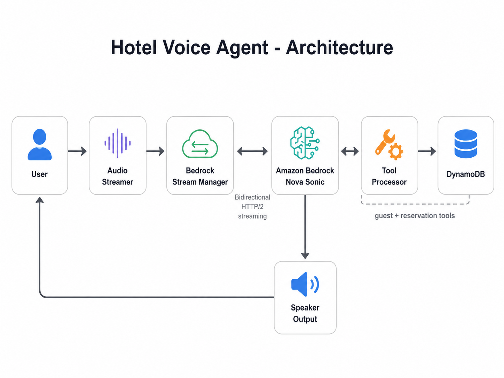

# Hotel Voice Agent with Amazon Bedrock Nova Sonic

A real-time speech-to-speech hotel assistant built with **Amazon Bedrock Nova Sonic**, **Python**, **PyAudio**, and **DynamoDB**.

**This project was built as the final capstone for the AWS Bootcamp: Build AI Apps with AWS Bedrock course from Zero To Mastery Academy.**

The agent listens through the microphone, continuously streams audio to Nova Sonic, uses tools to read or update hotel reservation data, and plays the generated voice response back to the user.

### Disclaimer

This is a course capstone and demonstration project. The sample guest and reservation records are fictional, and the project should be hardened further before being used with real customer data.

## Architecture



## Project structure

```text
.
├── app.py                 # Optional Streamlit conversation/log viewer
├── db_setup.py            # Creates and seeds the demo DynamoDB tables
├── hotel_agent.py         # Main real-time voice agent
├── requirements.txt       # Python dependencies
├── .env.example           # Example AWS environment variables
├── .gitignore             # Prevents local secrets and generated files from being committed
└── docs/
    └── architecture.png   # Project architecture diagram
```

## Code overview

### `hotel_agent.py`
The main application. It:

- captures microphone input with PyAudio,
- sends audio chunks through a bidirectional Bedrock stream,
- receives text, audio, and tool-call events,
- runs guest and reservation tools,
- and plays the generated audio response.

### `db_setup.py`
Creates two demo DynamoDB tables:

- `Hotel_Guests`
- `Hotel_Reservations`

It also inserts sample guests and reservations for testing.

> `db_setup.py` deletes and recreates these demo tables. Run it only in a development or sandbox AWS account.

### `app.py`
An optional Streamlit viewer that reads `assistant.log` and displays conversation messages, tool activity, events, and token usage.

## AWS credentials

Do not place real AWS keys directly inside the Python files or commit them to GitHub.

This repository includes a safe example file named `.env.example`. After cloning the repo, copy it to `.env`:

```bash
cp .env.example .env
```

Then enter your own AWS values:

```env
AWS_ACCESS_KEY_ID=your_access_key_here
AWS_SECRET_ACCESS_KEY=your_secret_key_here
AWS_DEFAULT_REGION=us-east-1
```

The real `.env` file is ignored by Git through `.gitignore`.

You can also use your normal AWS CLI or AWS profile configuration instead of a `.env` file.

## Before running

You will need:

- Python 3.11 or 3.12
- an AWS account
- access to Amazon Bedrock Nova Sonic in `us-east-1`
- permissions to invoke the Bedrock model
- permissions to create, read, and update the demo DynamoDB tables
- a working microphone and speaker

## Run locally after cloning

### 1. Clone the repository

```bash
git clone <your-repository-url>
cd bedrock-hotel-voice-agent
```

### 2. Create a virtual environment

```bash
python3 -m venv .venv
source .venv/bin/activate
```

### 3. Install dependencies

```bash
python -m pip install --upgrade pip
pip install -r requirements.txt
```

### 4. macOS PyAudio setup

PyAudio may require PortAudio on macOS:

```bash
brew install portaudio
pip install pyaudio
```

### 5. Configure AWS credentials

```bash
cp .env.example .env
```

Open `.env` and replace the placeholder values with your own credentials.

### 6. Create the demo DynamoDB tables

```bash
python db_setup.py
```

### 7. Run the voice agent

```bash
python -u hotel_agent.py --debug 2>&1 | tee assistant.log
```

Speak into your microphone. Press **Enter** in the terminal to stop the session.

### 8. Run the optional Streamlit viewer

Open another terminal, activate the same virtual environment, and run:

```bash
streamlit run app.py
```

## Demo capabilities

The voice agent can:

- look up a guest profile,
- verify guest details through the conversation,
- check upcoming and previous reservations,
- report reservation and balance information,
- update a room type,
- add a special request to a reservation.

## Barge-in

The project supports **barge-in**, which means the user can interrupt while the assistant is speaking. When an interruption is detected, the application clears queued response audio and begins processing the new user speech instead of forcing the user to wait for the full response to finish.

## Technologies

- Amazon Bedrock Nova Sonic
- Python and `asyncio`
- PyAudio
- DynamoDB
- Boto3
- Streamlit
